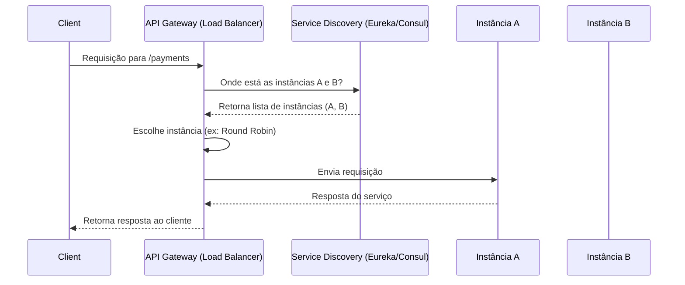

# system-design-cloud-with-spring

```mermaid

sequenceDiagram
    participant Client
    participant API_Gateway as API Gateway (Load Balancer)
    participant Service_Discovery as Service Discovery (Eureka/Consul)
    participant Microservice_A as Instância A
    participant Microservice_B as Instância B

    Client->>API_Gateway: Requisição para /payments
    API_Gateway->>Service_Discovery: Onde está as instâncias A e B?
    Service_Discovery-->>API_Gateway: Retorna lista de instâncias (A, B)
    API_Gateway->>API_Gateway: Escolhe instância (ex: Round Robin)
    API_Gateway->>Microservice_A: Envia requisição
    Microservice_A-->>API_Gateway: Resposta do serviço
    API_Gateway-->>Client: Retorna resposta ao cliente

```

